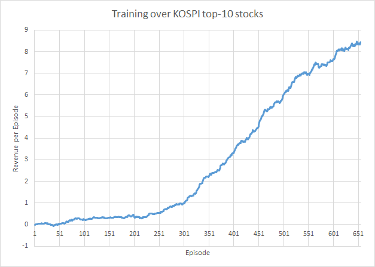

# Stock Trading Market OpenAI Gym Environment with Deep Reinforcement Learning using Keras

## Overview
The project is currently adjusting the code from <a href="https://github.com/kh-kim/stock_market_reinforcement_learning">stock market reinforcement learning</a> to match the current version.
It is still in progress and will continue to be updated. Additionally, the goal is to make it executable on Colab.

### Main Topic of the Original Project
The original project provides a general environment for stock market trading simulation using [OpenAI Gym](https://gym.openai.com/). 
Training data is a close price of each day, which is downloaded from Google Finance, but you can apply any data if you want.
Also, it contains simple Deep Q-learning and Policy Gradient from [Karpathy's post](http://karpathy.github.io/2016/05/31/rl/).

## Requirements
- Python2.7 or higher
- Numpy
- HDF5
- Keras with Beckend (Theano or/and Tensorflow)
- OpenAI Gym

## Usage

Note that the most sample training data in this repo is Korean stock. 
You may need to re-download your own training data to fit your purpose.

After meet those requirements in above, you can begin the training both algorithms, Deep Q-learning and Policy Gradient.

Train Deep Q-learning:

     	!python market_dqn.py 

Train Policy Gradient:

	!python market_pg.py 

For example, you can do like this:

	!python market_pg.py ./kospi_10.csv pg.h5

Aware that the provided neural network architecture in this repo is too small to learn.
So, it may under-fitting if you try to learn every stock data.
It just fitted for 10 to 100 stock data for a few years. (I checked!!)  
Thus you need to re-design your own architecture and   
**let me know if you have better one!**

Below is training curve for Top-10 KOSPI stock datas for 4 years using Policy Gradient.  

## Problem Now
- GPU memory overflow
